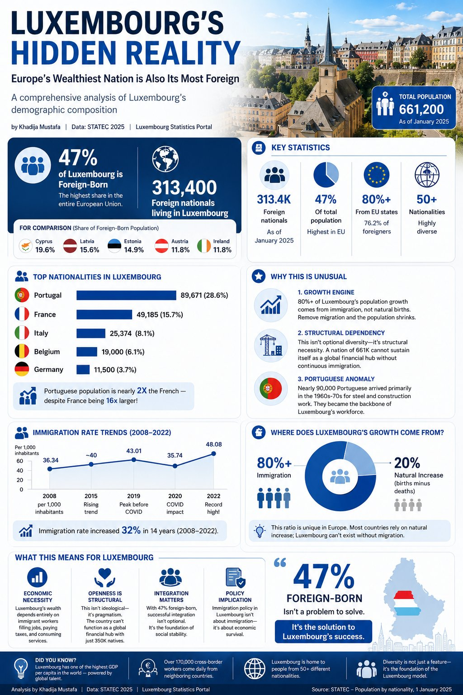

# Luxembourg Demographics Analysis

> *"47% of Luxembourg's population is foreign-born — the highest share in the entire European Union."*

A personal and data-driven analysis of Luxembourg's uniquely diverse demographic composition, immigration trends, and the human stories behind the statistics.

---

## Personal Context

I relocated to Luxembourg 10 years ago, following my husband. Over time I noticed something unique: almost everyone here has a story from somewhere else — different languages, different cultures, different journeys, and yet they all become part of the same society.

This project started as a data analysis assignment and slowly became something more personal. Because behind every percentage is a human story.

**📊 Data Source:** STATEC (Luxembourg Statistics Portal), January 2025

---

## Key Findings

| Metric | Value |
|--------|-------|
| Total Population (Jan 2025) | 661,200 |
| Foreign-Born Share | **47%** — highest in the EU |
| Total Foreign Nationals | 313,400 |
| EU Nationals among foreigners | 80%+ |
| Nationalities Represented | 50+ |
| Growth from Immigration | **80%+** of total population growth |
| Daily Cross-Border Workers | 220,000+ |

---

## Repository Structure

```
Luxembourg-Demographics-Analysis/
│
├── data/
│   ├── Luxembourg_Foreign_Population.csv          # Top 5 nationalities (original)
│   ├── Luxembourg_Foreign_Population_Full.csv     # All nationalities + EU status + era
│   ├── Immigration_Trends.csv                     # Immigration rate 2008–2025
│   ├── Population_Growth_Components.csv           # Natural increase vs net migration by year
│   ├── Cross_Border_Workers.csv                   # 220K+ daily workers from FR/BE/DE
│   ├── EU_vs_NonEU_Foreign_Population.csv         # EU vs Non-EU split over time
│   └── Foreign_Population_Demographics.csv        # Gender & age breakdown by nationality
│
├── visuals/
│   └── Luxembourg_Population.png                  # Published infographic
│
└── README.md
```

---

## Dataset Overview

### 1. Foreign Population — Full Nationality Breakdown
All 50+ nationalities grouped, including EU membership status and primary arrival era.

| Nationality | Population | Share | EU? |
|-------------|-----------|-------|-----|
| 🇵🇹 Portugal | 89,671 | 28.6% | Yes |
| 🇫🇷 France | 49,185 | 15.7% | Yes |
| 🇮🇹 Italy | 25,374 | 8.1% | Yes |
| 🇧🇪 Belgium | 19,000 | 6.1% | Yes |
| 🇩🇪 Germany | 11,500 | 3.7% | Yes |
| 🇷🇴 Romania | 8,200 | 2.6% | Yes |
| Other | 110,471 | 35.2% | Mixed |

> 📌 The Portuguese community is nearly **2× the size of the French** — despite France being 16× larger in population.

### 2. Immigration Rate Trends (2008–2025)

| Year | Rate (per 1,000) | Foreign Pop. | % of Total |
|------|-----------------|-------------|------------|
| 2008 | 36.34 | 140,000 | 32.0% |
| 2019 | 43.01 | 215,000 | 39.5% |
| 2020 | 35.74 | 220,000 | 38.2% *(COVID dip)* |
| 2022 | 48.08 | 290,000 | 44.5% |
| 2025 | 50.25 | 313,400 | 47.4% |

Immigration rate increased **32% over 14 years** (2008–2022).

### 3. Population Growth: Immigration vs Natural Increase
Over 80% of Luxembourg's population growth comes from migration. Without it, the population would shrink.

### 4. Cross-Border Workers
Over **220,000 people** commute daily into Luxembourg from France, Belgium, and Germany — representing ~47% of the total workforce.

### 5. EU vs Non-EU Composition
The EU share has remained remarkably stable at ~80% since 2008, reflecting Luxembourg's deep integration within the EU single market.

### 6. Gender & Age by Nationality
Demographic breakdown revealing differences in age profiles across nationality groups — Portuguese workers skew older (median 42), reflecting their 1960s–70s arrival era.

---

## Infographic



*Published on LinkedIn — [view the post](https://www.linkedin.com/in/khadija-mustafa-98344527b/)*

---

## Why This Matters

| Angle | Insight |
|-------|---------|
| 🏗️ Economic Necessity | Luxembourg's wealth depends on immigrant workers filling jobs, paying taxes, consuming services |
| 🌍 Structural Diversity | This isn't optional diversity — a nation of 661K cannot sustain itself as a global financial hub with just 350K natives |
| 🇵🇹 Portuguese Anomaly | ~90,000 Portuguese arrived in the 1960s–70s for steel & construction; they became the backbone of the workforce |
| 📋 Policy Implication | Immigration policy in Luxembourg isn't about managing immigration — it's about economic survival |

---

## Tools Used

| Tool | Purpose |
|------|---------|
| Python (pandas) | Data cleaning & analysis |
| Power BI / Excel | Dashboard & visualization |
| STATEC Portal | Primary data source |
| Canva | Infographic design |

---

## Author

**Khadija Mustafa** — Data Analyst & ML Engineering Student  
📍 Luxembourg | 📧 engr.khadija.hussain@gmail.com  
[LinkedIn](https://www.linkedin.com/in/khadija-mustafa-98344527b/) · [GitHub](https://github.com/KhadijaTheAnalyst)

---
*Data: STATEC — Population by nationality, 1 January 2025*
